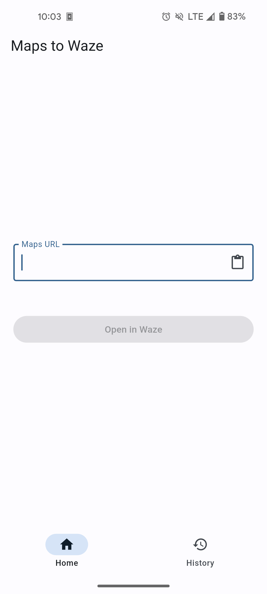
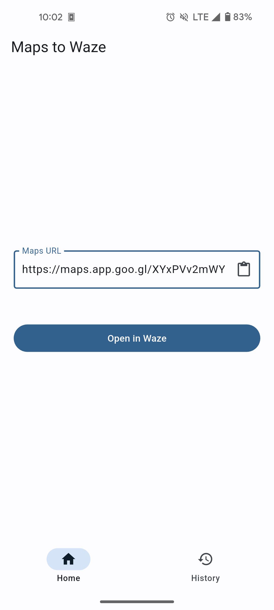
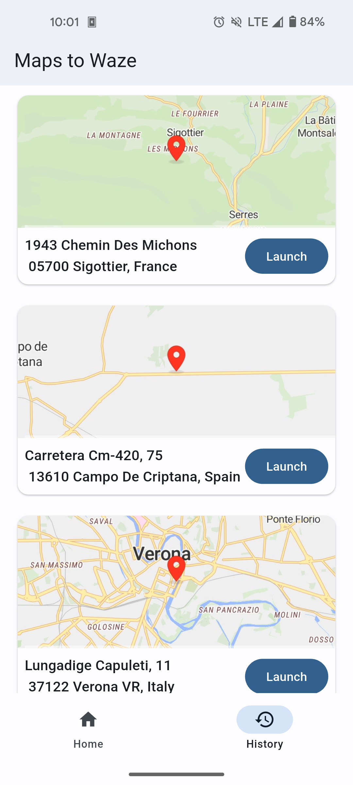
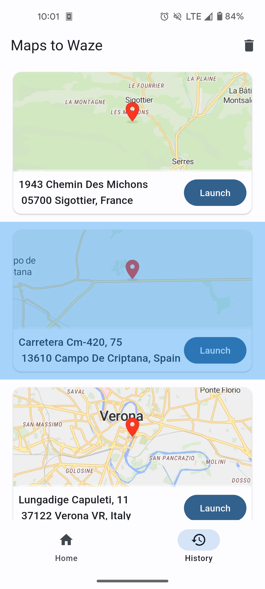
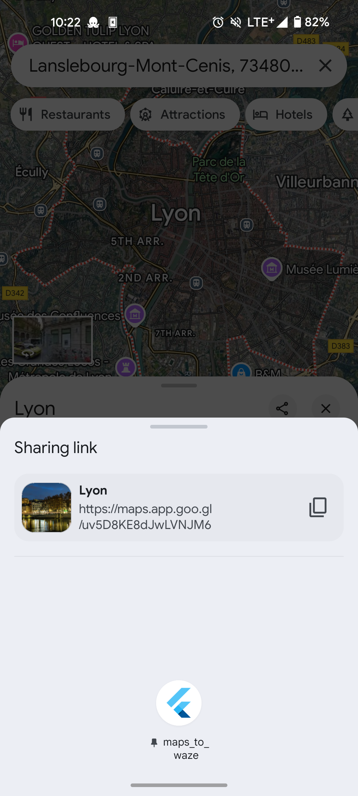

# Maps to Waze APP

This app allows you to open Google Maps locations in Waze, usefull for all the people like me who prefer to use Waze when driving instead of Google Maps.## Screenshots

| Home Screen | Convert URL | History Screen | Delete from History |
|-------------|----------------|----------------|----------------------|
|  |  |  |  |

## Features

- Open Maps URLs in Waze
- Share to convert
- History of conversions
- Map of past conversions

## Usage

When you have a Google Maps link there are 2 ways of opening it in Waze.

| Convert in App | Convert from Share |
|-------------|----------------|
|  |  |
